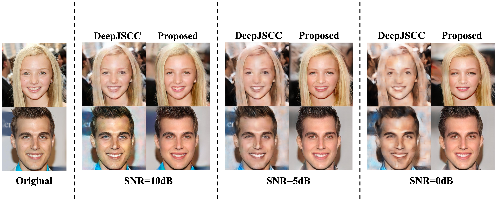

# Channel-aware GAN Inversion for Semantic Communication

This repository contains the implementation of a channel-aware GAN inversion method designed to extract meaningful semantic information from original inputs and map it into a channel-correlated latent space, which can eliminates the necessity for additional channel encoder and decoder.

## Prerequisites

Make sure you have the following dependencies installed:

- Python (>=3.6)
- PyTorch
- NumPy
- Pillow
- imageio
- tqdm
- lpips
- piq
- pytorch-msssim

You can install the required packages using the following command:

```bash
pip install -r requirements.txt
```

## Getting Started

1. Clone the repository:

```bash
git clone https://github.com/recusant7/GAN_SeCom.git
cd GAN_SeCom
```

2. Download the pre-trained model checkpoint:

```bash
wget https://github.com/seasonSH/SemanticStyleGAN/releases/download/1.0.0/CelebAMask-HQ-512x512.pt -O pretrained/CelebAMask-HQ-512x512.pt
```

## Running the Code

Run the inversion code with the following command:

```bash
python main.py --ckpt pretrained/CelebAMask-HQ-512x512.pt --outdir results/inversion --dataset ./data/examples --size 512 --batch_size 8 --snr_db 15
```

Make sure to adjust the arguments based on your requirements. You can find a description of the available arguments in the script.

## Secure Transmission (Cifrar)

The final latent can be sent through the Cifrar (Enc3) bit-level encryption and tamper-detection layer. The cipher lives in `cifrar.py` (unchanged, see [CIFRAR.md](CIFRAR.md)). `secure_channel.py` is the call-based bridge. `main.py` and `evaluate.py` only call it.

```bash
python main.py --ckpt pretrained/CelebAMask-HQ-512x512.pt --snr_db 15 --encrypt true
python evaluate.py --snr_list 10 13 14 15 20 --encrypt true --attack replay
```

Each image is sent as one packet:

```
latent -> quantise -> [header: seq, range | payload] -> Cifrar.encrypt -> BPSK
       -> AWGN -> channel attack -> hard decision -> Cifrar.decrypt
       -> integrity / header / replay checks -> dequantise -> generator
```

| Flag | Default | Meaning |
|------|---------|---------|
| `--encrypt` | `false` | Turn the secure link on |
| `--cipher_seed` | `42` | Shared secret |
| `--quant_bits` | `8` | Latent quantisation (8 or 16 bit) |
| `--on_tamper` | `drop` | `drop`: packets that fail the integrity check become an all-zero latent. `keep`: decode them anyway |
| `--replay_check` | `strict` | Sequence-number check: `strict` (seq must match the receiver slot), `monotonic`, or `off` (plain Cifrar, replays pass) |

Things to know:

- The cipher is not differentiable, so the latent optimisation still runs through the analog channel. Only the final transmission is encrypted.
- Encrypted runs are saved under `<attack>_cifrar`, so they never overwrite unencrypted results.
- One image costs about 1.3 M BPSK symbols (vs 14,336 analog channel uses) and about 4 s of CPU time for encrypt + decrypt.
- There is no error-correcting code, so any bit error fails the integrity check. Rejection goes from 0% at 15 dB to 100% at 13 dB.
- `evaluate.py` adds `reject_rate`, `tamper_rate`, `replay_rate`, `link_ber` and `channel_uses` columns, plus `security_vs_snr.png`.
- Tests (CPU, no checkpoint needed): `python test_secure_channel.py`. Add `--full` for the SNR sweep at real latent size.

## Results

The results, including reconstructed images and log files, will be saved in the specified output directory (`--outdir`). Check the log files for average PSNR, MS-SSIM, and LPIPS.


## Acknowledgments

- This code is based on [SemanticGAN](https://github.com/nv-tlabs/semanticGAN_code) and [SemanticStyleGAN](https://github.com/seasonSH/SemanticStyleGAN/tree/main). We extend our sincere thanks to the authors of these projects for their valuable works.

